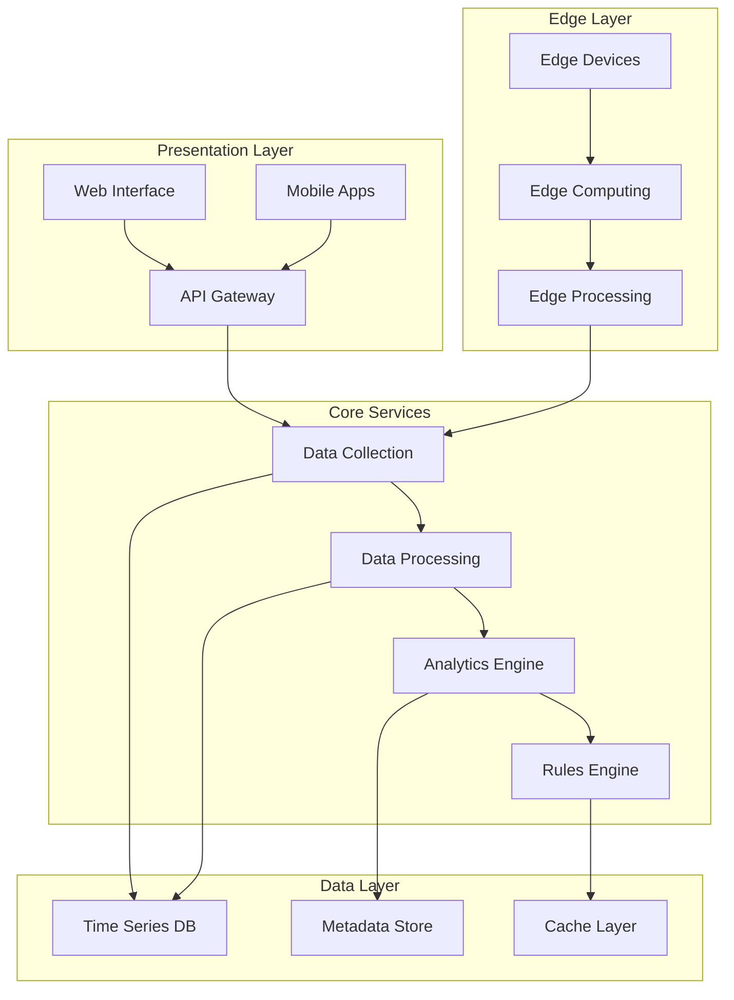
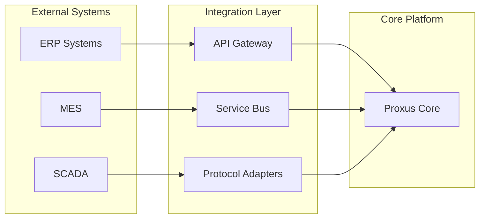
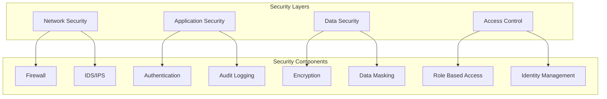

## Platform Overview



## Core Components

<Tabs>
  <Tab title="Data Collection">
    <Grid cols={2}>
      <Card title="Protocol Adapters" icon="plug">
        ```mermaid
        graph TD
            A[Device Layer] --> B[Protocol Layer]
            B --> C[Data Normalization]
            B --> D[Security Layer]
            C --> E[Collection Service]
            D --> E
            E --> F[Data Buffer]
        ```
      </Card>
      <Card title="Supported Protocols" icon="list">
        - OPC UA
        - Modbus TCP/RTU
        - MQTT
        - BACnet
        - S7
        - Custom Protocols
      </Card>
    </Grid>
  </Tab>

  <Tab title="Processing Engine">
    <Grid cols={2}>
      <Card title="Data Flow" icon="stream">
        ```mermaid
        graph LR
            A[Raw Data] --> B[Preprocessing]
            B --> C[Analytics]
            C --> D[Rules Engine]
            D --> E[Actions]
        ```
      </Card>
      <Card title="Processing Types" icon="gears">
        - Stream Processing
        - Batch Processing
        - Real-time Analytics
        - Machine Learning
        - Event Processing
      </Card>
    </Grid>
  </Tab>

  <Tab title="Storage">
    <Grid cols={2}>
      <Card title="Data Architecture" icon="database">
        ```mermaid
        graph TD
            A[Time Series Data] --> B[Hot Storage]
            A --> C[Warm Storage]
            A --> D[Cold Storage]
            B --> E[In-Memory Cache]
            C --> F[Aggregation Layer]
        ```
      </Card>
      <Card title="Storage Features" icon="hard-drive">
        - Multi-tier Storage
        - Data Compression
        - Auto-partitioning
        - Backup & Recovery
        - Data Lifecycle
      </Card>
    </Grid>
  </Tab>
</Tabs>

## System Integration



## High Availability Architecture

<CardGroup cols={2}>
  <Card title="Active-Active Configuration" icon="shield-check">
    ```mermaid
    graph TD
        LB[Load Balancer]
        LB --> N1[Node 1]
        LB --> N2[Node 2]
        N1 --> DB[(Database Cluster)]
        N2 --> DB
    ```
  </Card>
  <Card title="Disaster Recovery" icon="rotate">
    ```mermaid
    graph LR
        DC1[Primary DC] --> SYNC[Data Sync]
        SYNC --> DC2[Secondary DC]
        DC1 -.-> |Failover| DC2
    ```
  </Card>
</CardGroup>

## Security Architecture



## Deployment Models

<Tabs>
  <Tab title="On-Premises">
    ```mermaid
    graph TD
        subgraph "Enterprise Network"
            FW[Firewall]
            APP[Application Servers]
            DB[Database Cluster]
            EDGE[Edge Nodes]
        end
        
        FW --> APP
        APP --> DB
        EDGE --> APP
    ```
  </Tab>
  
  <Tab title="Cloud">
    ```mermaid
    graph TD
        subgraph "Cloud Infrastructure"
            LB[Load Balancer]
            AS[Auto Scaling Group]
            S3[Object Storage]
            RDS[Managed Database]
        end
        
        LB --> AS
        AS --> RDS
        AS --> S3
    ```
  </Tab>
  
  <Tab title="Hybrid">
    ```mermaid
    graph LR
        subgraph "On-Premises"
            EDGE[Edge Layer]
            DATA[Local Data]
        end
        
        subgraph "Cloud"
            CLOUD[Cloud Services]
            STORAGE[Cloud Storage]
        end
        
        EDGE --> DATA
        EDGE --> CLOUD
        DATA -.-> STORAGE
    ```
  </Tab>
</Tabs>

## Performance Metrics

<CardGroup cols={3}>
  <Card title="Data Collection" icon="gauge-high">
    - Ingestion Rate: 100K points/sec
    - Latency: <10ms
    - Protocol Support: 10+
  </Card>
  
  <Card title="Processing" icon="bolt">
    - Stream Processing: Real-time
    - Batch Processing: 1M records/sec
    - Analytics: Sub-second
  </Card>
  
  <Card title="Storage" icon="database">
    - Write Speed: 1M points/sec
    - Query Response: <100ms
    - Compression: 10:1 ratio
  </Card>
</CardGroup>

## See Also
- [Deployment Guide](/deployment)
- [Security Configuration](/security)
- [Integration Guide](/integration)
- [Performance Tuning](/performance)