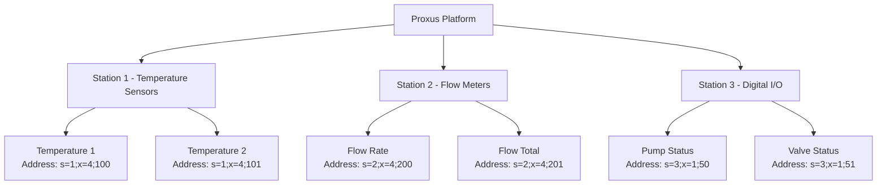
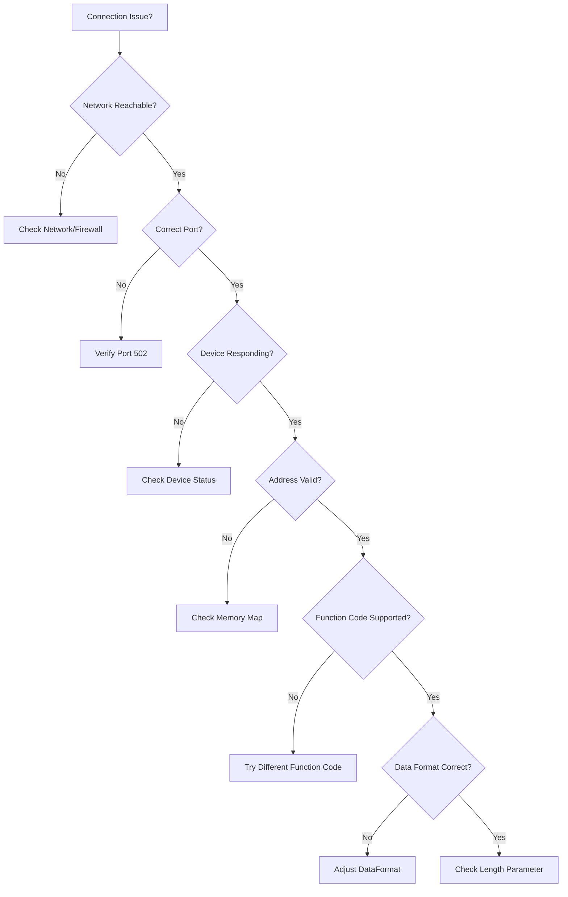

## Introduction

This guide provides detailed instructions for implementing Modbus TCP integration in Proxus. Modbus TCP is a widely adopted industrial communication protocol that enables reliable data acquisition from industrial devices over TCP/IP networks.

### Why Modbus TCP?

- **Industry Standard:** Widely supported across industrial devices and systems
- **TCP/IP Native:** Built for modern Ethernet-based industrial networks
- **Reliable Communication:** TCP ensures guaranteed message delivery
- **Simple Implementation:** Straightforward addressing and data access
- **Scalable Architecture:** Support for multiple devices and extensive data points

## Device Profile Configuration

### Creating a Modbus TCP Device Profile

1. **Profile Name**: Enter a descriptive name for your device profile
2. **Description**: Add optional details about the device or application
3. **Protocol Selection**: Choose "MODBUS TCP" from the protocol dropdown

### Connection Parameters

Configure the communication settings for your Modbus TCP device:

| Parameter | Description | Default Value | Range/Format | Required |
|-----------|-------------|---------------|--------------|----------|
| **Host** | IP address of the Modbus TCP device | - | IPv4 format | Yes |
| **Port** | TCP port number for Modbus communication | 502 | 1-65535 | No |
| **ReadingFrequency** | Interval between reading cycles (ms) | 1000 | 100-60000 | No |
| **ConnectTimeOut** | Connection timeout duration (ms) | 1000 | 500-30000 | No |
| **ReceiveTimeOut** | Response timeout duration (ms) | 1000 | 500-30000 | No |
| **DataFormat** | Byte order for multi-register data | ABCD | ABCD, BADC, CDAB, DCBA | No |

### Data Format Options

The DataFormat parameter determines how multi-register values are interpreted:

<AccordionGroup>
  <Accordion title="Byte Order Formats">
    - **ABCD**: Big-endian, high word first (default) - Most common format
    - **BADC**: Big-endian, low word first - Used by some PLCs
    - **CDAB**: Little-endian, high word first - Alternative format
    - **DCBA**: Little-endian, low word first - Reverse byte order
  </Accordion>
</AccordionGroup>

## Tag Configuration

### Creating Read Tags

Tags represent individual data points to be read from your Modbus TCP device. Each tag requires:

1. **Name**: Descriptive identifier for the data point
2. **Address**: Modbus address specification
3. **Data Type**: Type of data to read
4. **Length**: Number of registers/characters to read (for variable-length types)
5. **Polling Interval**: Individual polling frequency (0 = use device default)

### Address Format

Proxus uses an enhanced address format for reading operations:

#### Basic Format
```
[s=station];[x=function];address[.bit]
```

#### Address Components

| Component | Description | Default | Example |
|-----------|-------------|---------|---------|
| **s=station** | Modbus station/slave ID | 1 | s=2 |
| **x=function** | Read function code | 3 | x=4 |
| **address** | Register or coil number | - | 100 |
| **.bit** | Specific bit within a register | - | .5 |

### Function Codes

<AccordionGroup>
  <Accordion title="Read Function Codes">
    | Function Code | Operation | Address Prefix | Description |
    |---------------|-----------|----------------|-------------|
    | 01 | Read Coils | `x=1;` | Read discrete output coil status |
    | 02 | Read Discrete Inputs | `x=2;` | Read discrete input contact status |
    | 03 | Read Holding Registers | (default) | Read holding register values |
    | 04 | Read Input Registers | `x=4;` | Read input register values |
  </Accordion>
</AccordionGroup>

### Address Examples

| Address Format | Description | Function Code | Data Access |
|----------------|-------------|---------------|-------------|
| `100` | Holding register 100 | 03 | Read holding register |
| `s=2;100` | Register 100 on station 2 | 03 | Read holding register |
| `x=4;100` | Input register 100 | 04 | Read input register |
| `s=2;x=4;100` | Input register 100 on station 2 | 04 | Read input register |
| `100.0` | Bit 0 of holding register 100 | 03 | Read register bit |
| `x=2;100` | Discrete input 100 | 02 | Read discrete input |
| `x=1;100` | Coil 100 | 01 | Read coil status |

## Data Types

### Supported Data Types

<AccordionGroup>
  <Accordion title="Fixed-Size Data Types">
    | Data Type | Size (Registers) | Size (Bytes) | Description | Range | Length Usage |
    |-----------|------------------|--------------|-------------|-------|--------------|
    | **Bool** | - | 1 bit | Boolean value (coil/discrete) | true/false | Not used |
    | **Short** | 1 | 2 bytes | Signed short integer | -32,768 to 32,767 | Not used |
    | **UShort** | 1 | 2 bytes | Unsigned short integer | 0 to 65,535 | Not used |
    | **Int** | 2 | 4 bytes | Signed integer | -2,147,483,648 to 2,147,483,647 | Not used |
    | **UInt** | 2 | 4 bytes | Unsigned integer | 0 to 4,294,967,295 | Not used |
    | **Float** | 2 | 4 bytes | Single-precision floating point | IEEE 754 single precision | Not used |
    | **Long** | 4 | 8 bytes | Signed long integer | Large signed integer values | Not used |
    | **ULong** | 4 | 8 bytes | Unsigned long integer | Large unsigned integer values | Not used |
    | **Double** | 4 | 8 bytes | Double-precision floating point | IEEE 754 double precision | Not used |
    | **DateTime** | 4 | 8 bytes | Date and time value | Date and time representation | Not used |
  </Accordion>
  
  <Accordion title="Variable-Length Data Types">
    | Data Type | Description | Length Usage | Character/Byte Calculation |
    |-----------|-------------|--------------|---------------------------|
    | **String** | Variable-length string for text data | **Required** | Characters = Length × 2 |
    | **Bytes** | Variable-length byte data for binary data | **Required** | Bytes = Length × 2 |
  </Accordion>
</AccordionGroup>

### Variable-Length Data Configuration

#### String Data Type
- **Length**: Number of registers to read for string data
- **Character Count**: Each register contains 2 ASCII characters
- **Total Characters**: Length × 2

#### Bytes Data Type
- **Length**: Number of registers to read for binary data
- **Byte Count**: Each register contains 2 bytes
- **Total Bytes**: Length × 2

## Configuration Examples

<AccordionGroup>
  <Accordion title="Basic Sensor Readings">
    ### Temperature Sensor
    ```json
    {
      "Name": "Temperature",
      "Address": "s=1;x=4;100",
      "DataType": "Float",
      "Length": 0,
      "PollingInterval": 1000
    }
    ```
    *Reads temperature value from input register 100 on station 1*

    ### Flow Velocity Measurement
    ```json
    {
      "Name": "Flow Velocity",
      "Address": "s=1;x=2;30000",
      "DataType": "Float",
      "Length": 0,
      "PollingInterval": 0
    }
    ```
    *Reads flow velocity from discrete input 30000 on station 1*
  </Accordion>
  
  <Accordion title="Digital I/O Monitoring">
    ### Pump Status
    ```json
    {
      "Name": "Pump Status",
      "Address": "s=2;x=1;50",
      "DataType": "Bool",
      "Length": 0,
      "PollingInterval": 500
    }
    ```
    *Monitors pump coil status from coil 50 on station 2*

    ### Register Bit Reading
    ```json
    {
      "Name": "Alarm Status",
      "Address": "s=1;100.5",
      "DataType": "Bool",
      "Length": 0,
      "PollingInterval": 250
    }
    ```
    *Reads bit 5 from holding register 100 on station 1*
  </Accordion>
  
  <Accordion title="Variable-Length Data">
    ### Device Name String
    ```json
    {
      "Name": "Device Name",
      "Address": "s=2;x=4;400",
      "DataType": "String",
      "Length": 10,
      "PollingInterval": 5000
    }
    ```
    *Reads device name string (10 registers/20 characters) from input registers 400-409*

    ### Configuration Data
    ```json
    {
      "Name": "Config Block",
      "Address": "s=1;x=3;500",
      "DataType": "Bytes",
      "Length": 8,
      "PollingInterval": 10000
    }
    ```
    *Reads configuration data (8 registers/16 bytes) from holding registers 500-507*
  </Accordion>
</AccordionGroup>

## Advanced Features

### Bit-Level Reading

Read specific bits from registers:

```json
{
  "Address": "100.5",
  "DataType": "Bool"
}
```

This reads bit 5 (0-indexed) from holding register 100.

### Dynamic Data Format

Override the default data format for multi-register data types:

```json
{
  "Address": "format=BADC;s=2;100",
  "DataType": "Float"
}
```

### Multiple Station Configuration



## Best Practices

### Performance Optimization

<AccordionGroup>
  <Accordion title="Data Organization">
    1. **Group Sequential Addresses**: Place related tags in consecutive registers when possible
    2. **Optimize Polling Intervals**: Use appropriate polling frequencies based on data change rates
    3. **Minimize Station Queries**: Group tags by station number to reduce network traffic
    4. **Use Appropriate Data Types**: Choose the most efficient data type for your data
    5. **Batch Reading**: Configure tags with similar polling intervals together
  </Accordion>
  
  <Accordion title="Length Parameter Guidelines">
    1. **Exact Sizing**: Set Length to match the exact data size to avoid reading unnecessary registers
    2. **Device Limits**: Check device documentation for maximum readable register ranges
    3. **Performance Impact**: Larger Length values increase network traffic and processing time
    4. **Data Alignment**: Ensure string/bytes data is properly aligned in device memory
    5. **Buffer Considerations**: Leave some buffer for variable content but avoid excessive overhead
  </Accordion>
</AccordionGroup>

### Data Acquisition Strategy

1. **Critical Data**: Use shorter polling intervals (100-500ms) for critical process data
2. **Status Information**: Use moderate intervals (1-5 seconds) for status monitoring
3. **Configuration Data**: Use longer intervals (10+ seconds) for slowly changing data
4. **Variable-Length Data**: 
   - **String**: Set Length based on expected text length
   - **Bytes**: Set Length based on binary data size
   - **Performance**: Avoid unnecessarily large Length values

## Troubleshooting

### Common Issues and Solutions

<AccordionGroup>
  <Accordion title="Connection Problems">
    | Issue | Possible Cause | Solution |
    |-------|----------------|----------|
    | Connection Timeout | Network connectivity, wrong IP/port | Verify network settings and device availability |
    | Connection Refused | Device not responding, firewall blocking | Check device status and network configuration |
    | Intermittent Disconnections | Network instability, timeout settings | Adjust timeout values and check network stability |
  </Accordion>
  
  <Accordion title="Data Reading Errors">
    | Issue | Possible Cause | Solution |
    |-------|----------------|----------|
    | Invalid Address | Address doesn't exist on device | Check device documentation for valid address ranges |
    | Data Format Error | Wrong byte order for multi-register values | Adjust DataFormat parameter (ABCD, BADC, etc.) |
    | Function Code Error | Device doesn't support function code | Try different function codes (03, 04, 01, 02) |
    | Length Parameter Error | Wrong Length for String/Bytes | Set correct Length value for variable data types |
    | Address Range Error | Length exceeds available registers | Reduce Length or check device memory map |
  </Accordion>
</AccordionGroup>

### Diagnostic Steps



## Technical Specifications

### Protocol Compliance
- **Modbus TCP**: Full compliance with Modbus Application Protocol v1.1b3
- **Message ID Management**: Automatic increment for request tracking
- **Error Detection**: TCP-based error handling and timeout management
- **Data Integrity**: Built-in validation and retry mechanisms

### Performance Characteristics
- **Maximum Tags**: Limited by device capacity and network bandwidth
- **Update Rate**: Configurable from 100ms to 60 seconds per tag
- **Concurrent Devices**: Multiple device connections supported
- **Data Throughput**: Optimized for industrial monitoring applications

### Data Type Specifications

| Category | Data Types | Registers | Bytes | Length Parameter | Usage |
|----------|------------|-----------|-------|------------------|-------|
| **Single Register** | Short, UShort | 1 register | 2 bytes | Not used | Basic integers |
| **Multi-Register** | Int, UInt, Float | 2 registers | 4 bytes | Not used | Extended integers, floating point |
| **Extended** | Long, ULong, Double, DateTime | 4 registers | 8 bytes | Not used | Large values, high precision |
| **Bit-Level** | Bool | - | 1 bit | Not used | Coils, discrete inputs |
| **Variable** | String, Bytes | Variable | Variable | **Required** | Text, binary data |

## Memory Areas Access

| Memory Area | Function Code | Address Prefix | Data Types | Typical Use |
|-------------|---------------|----------------|------------|-------------|
| Coils | 01 | `x=1;` | Bool | Digital outputs status |
| Discrete Inputs | 02 | `x=2;` | Bool | Digital inputs status |
| Holding Registers | 03 | (default) | All types | Process variables, setpoints |
| Input Registers | 04 | `x=4;` | All types | Sensor readings, measurements |

## Support and Resources

For additional support and advanced configuration options, refer to:
- Device manufacturer's Modbus TCP documentation
- Modbus TCP protocol specifications
- Proxus IIoT Platform user manual
- Network configuration guidelines

---

*This documentation covers Modbus TCP reading operations in Proxus IIoT Platform. For device-specific implementation details, consult the manufacturer's documentation and Modbus TCP specifications.*