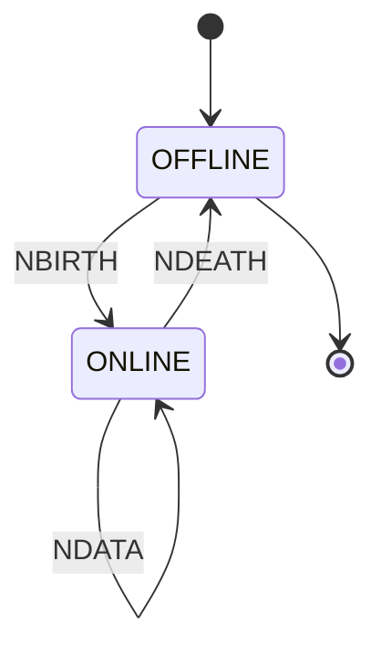

## Introduction

This guide provides detailed instructions for implementing Sparkplug B integration in Proxus. Sparkplug B is an industrial IoT-focused MQTT specification that provides standardized approach to MQTT implementation including state management, payload formatting, and topic namespace management.

### Why Sparkplug B?

- **Well-defined Topic Namespace:** Structured approach to MQTT topic organization
- **State Management:** Built-in birth/death certificate handling
- **Auto-discovery:** Dynamic device and metric discovery capabilities
- **Data Type Standardization:** Consistent payload formatting
- **Bidirectional Communication:** Native support for command and control

## Configuration Parameters

### Core Connection Parameters

| Parameter | Description | Default | Required | Example |
|-----------|-------------|----------|----------|----------|
| BrokerHost | MQTT broker hostname or IP address | localhost | Yes | "mqtt.company.com" |
| BrokerPort | MQTT broker port number | 1883 | No | 1883 |
| GroupId | Logical grouping of Edge nodes | ProxusGroup | No | "Plant1" |
| EdgeNodeId | Unique identifier for the Edge node | Edge_{UUID} | No | "Edge_Production" |
| ScadaHostIdentifier | Primary application identifier | scada1 | No | "mainScada" |

### Authentication Parameters

| Parameter | Description | Default | Required | Example |
|-----------|-------------|----------|----------|----------|
| Username | MQTT broker username | - | No | "proxus_user" |
| Password | MQTT broker password | - | No | "secure_password" |

### Protocol Settings

| Parameter | Description | Default | Options | Example |
|-----------|-------------|----------|----------|----------|
| Protocol | MQTT protocol version | V311 | V310, V311, V500 | "V311" |
| ReconnectInterval | Time between reconnection attempts (seconds) | 5 | 1-3600 | "30" |

### WebSocket Configuration

| Parameter | Description | Default | Required | Example |
|-----------|-------------|----------|----------|----------|
| UseWebSocket | Enable WebSocket transport | false | No | true |
| WebSocketPath | WebSocket endpoint path | /mqtt | No* | "/ws" |

*Required only when UseWebSocket is true

### TLS Security Configuration

| Parameter | Description | Default | Required | Example |
|-----------|-------------|----------|----------|----------|
| UseTls | Enable TLS encryption | false | No | true |
| TlsVersion | TLS protocol version | Tls12 | No | "Tls13" |
| PfxCertificate | Base64 encoded PFX certificate | - | No* | "MIIKYwIBA..." |
| ValidateCertificate | Enable certificate validation | true | No | false |

*Required when UseTls is true

## Advanced Configuration Examples

### Basic MQTT Configuration
```json
{
  "BrokerHost": "mqtt.example.com",
  "BrokerPort": 1883,
  "GroupId": "Factory1",
  "EdgeNodeId": "Assembly_Line_1",
  "Protocol": "V311"
}
```

### Secure WebSocket Configuration
```json
{
  "BrokerHost": "mqtt.example.com",
  "BrokerPort": 443,
  "UseWebSocket": true,
  "WebSocketPath": "/mqtt",
  "UseTls": true,
  "TlsVersion": "Tls12"
}
```

### Enterprise Authentication Configuration
```json
{
  "BrokerHost": "mqtt.enterprise.com",
  "UseTls": true,
  "TlsVersion": "Tls13",
  "PfxCertificate": "<base64-certificate>",
  "Username": "enterprise_user",
  "Password": "secure_password"
}
```

## Data Type Mapping

### Automatic Type Detection

The integration automatically detects and maps data types based on the value content:

| Value Pattern | Sparkplug B Type | Example |
|---------------|------------------|----------|
| true/false | Boolean | true |
| Integer numbers | Int32 | 42 |
| Decimal numbers | Float/Double | 23.5 |
| Date strings | DateTime | "2025-03-06T12:00:00Z" |
| Other strings | String | "Running" |

### Supported Data Types

<AccordionGroup>
  <Accordion title="Numeric Types">
    - **Int16:** 16-bit signed integer (-32,768 to 32,767)
    - **UInt16:** 16-bit unsigned integer (0 to 65,535)
    - **Int32:** 32-bit signed integer (-2^31 to 2^31-1)
    - **UInt32:** 32-bit unsigned integer (0 to 2^32-1)
    - **Int64:** 64-bit signed integer (-2^63 to 2^63-1)
    - **UInt64:** 64-bit unsigned integer (0 to 2^64-1)
    - **Float:** 32-bit floating point
    - **Double:** 64-bit floating point
  </Accordion>
  
  <Accordion title="Other Types">
    - **Boolean:** true/false values
    - **String:** Text data
    - **DateTime:** Timestamp values
    - **Bytes:** Binary data
  </Accordion>
</AccordionGroup>

## Topic Structure and Namespace

### Topic Format
```
spBv1.0/[group_id]/[message_type]/[edge_node_id]/[device_id]
```

### Message Types

| Type | Description | Direction | Example |
|------|-------------|-----------|----------|
| NBIRTH | Node birth certificate | Node → Server | spBv1.0/Factory1/NBIRTH/Edge_01 |
| NDEATH | Node death certificate | Node → Server | spBv1.0/Factory1/NDEATH/Edge_01 |
| DBIRTH | Device birth certificate | Node → Server | spBv1.0/Factory1/DBIRTH/Edge_01/Device1 |
| DDEATH | Device death certificate | Node → Server | spBv1.0/Factory1/DDEATH/Edge_01/Device1 |
| NDATA | Node data | Node → Server | spBv1.0/Factory1/NDATA/Edge_01 |
| DDATA | Device data | Node → Server | spBv1.0/Factory1/DDATA/Edge_01/Device1 |
| NCMD | Node command | Server → Node | spBv1.0/Factory1/NCMD/Edge_01 |
| DCMD | Device command | Server → Node | spBv1.0/Factory1/DCMD/Edge_01/Device1 |

## State Management

### Node States



### Device States


## Error Handling and Troubleshooting

### Common Connection Issues

| Error | Possible Causes | Solutions |
|-------|----------------|-----------|
| Connection Refused | - Invalid credentials<br/>- Wrong port<br/>- Broker offline | - Verify credentials<br/>- Check broker status<br/>- Confirm port number |
| TLS Handshake Failed | - Invalid certificate<br/>- Wrong TLS version | - Validate certificate<br/>- Check TLS version compatibility |
| Topic Permission Error | - Insufficient permissions<br/>- Wrong topic structure | - Verify ACL settings<br/>- Check topic format |

### Debug Logging

Enable detailed logging by configuring the logging level:

```json
{
  "Logging": {
    "LogLevel": {
      "Default": "Information",
      "Proxus.Shared.Actors.OutboundIntegrations": "Debug"
    }
  }
}
```

## Performance Optimization

### Best Practices

1. **Message Rate Control**
   - Set appropriate publish rates
   - Use QoS levels wisely
   - Monitor broker performance

2. **Resource Management**
   - Control payload sizes
   - Manage connection pooling
   - Monitor memory usage

3. **Network Optimization**
   - Use appropriate QoS levels
   - Implement message batching
   - Consider compression for large payloads

### Recommended Settings

```json
{
  "PublishRate": "1000ms",
  "BatchSize": 100,
  "QoS": 1,
  "RetainMessages": false,
  "CompressPayload": true
}
```

## Security Considerations

### TLS Implementation

1. **Certificate Management**
   - Use strong certificates
   - Implement certificate rotation
   - Validate certificate chain

2. **Authentication**
   - Use strong passwords
   - Implement client certificates
   - Enable access control lists (ACLs)

### Example Secure Configuration

```json
{
  "UseTls": true,
  "TlsVersion": "Tls13",
  "ValidateCertificate": true,
  "CertificateValidation": {
    "ValidateChain": true,
    "AllowedCertificateAuthorities": ["CA1", "CA2"]
  }
}
```

## Monitoring and Metrics

### Key Performance Indicators

1. **Connection Metrics**
   - Connection state
   - Reconnection attempts
   - Connection latency

2. **Message Metrics**
   - Messages sent/received
   - Message latency
   - Error rates

3. **Device Metrics**
   - Active devices
   - Birth/death events
   - Command response times

### Example Monitoring Implementation

```javascript
// Monitoring metrics structure
{
  "connection": {
    "status": "connected",
    "lastConnected": "2025-03-06T12:00:00Z",
    "reconnectAttempts": 0
  },
  "messages": {
    "sent": 1000,
    "received": 950,
    "errors": 2
  },
  "devices": {
    "active": 5,
    "total": 6,
    "birthEvents": 10
  }
}
```

## Appendix

### Example Device Configuration

```json
{
  "device": {
    "id": "Device1",
    "metrics": [
      {
        "name": "temperature",
        "dataType": "Float",
        "properties": {
          "engUnit": "Celsius",
          "min": 0,
          "max": 100
        }
      },
      {
        "name": "status",
        "dataType": "String",
        "properties": {
          "enum": ["Running", "Stopped", "Error"]
        }
      }
    ]
  }
}
```

### Complete Integration Example

```json
{
  "integration": {
    "type": "SparkplugB",
    "connection": {
      "brokerHost": "mqtt.company.com",
      "brokerPort": 8883,
      "useTls": true,
      "tlsVersion": "Tls12",
      "useWebSocket": false
    },
    "authentication": {
      "username": "proxus_edge",
      "password": "secure_password"
    },
    "sparkplug": {
      "groupId": "Factory1",
      "edgeNodeId": "Assembly_Line_1",
      "scadaHostId": "MainScada"
    },
    "performance": {
      "publishRate": "1000ms",
      "reconnectInterval": 5,
      "batchSize": 100
    }
  }
}
```

This comprehensive documentation should provide all necessary information for implementing and maintaining a Sparkplug B integration with Proxus. For additional support or specific use cases, please contact Proxus support.